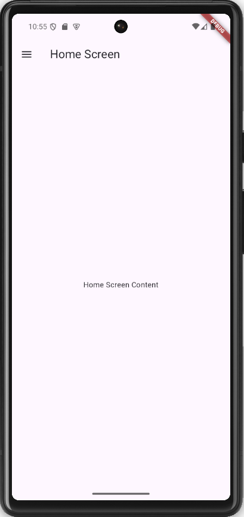
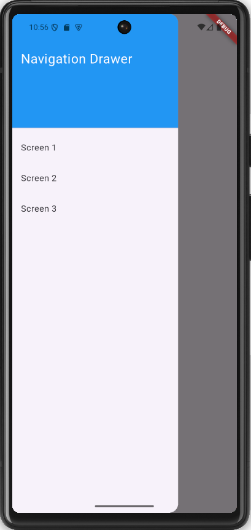

# task_08

## Screenshots

 
 
 

# Navigation Drawer App

A simple Flutter app demonstrating the use of a navigation drawer with multiple screens.

## Features

- **Navigation Drawer**: A drawer with options to navigate to different screens.
- **Multiple Screens**: Three screens (`Screen 1`, `Screen 2`, `Screen 3`) to demonstrate navigation.
- **Responsive Design**: Works seamlessly on both mobile and tablet devices.

