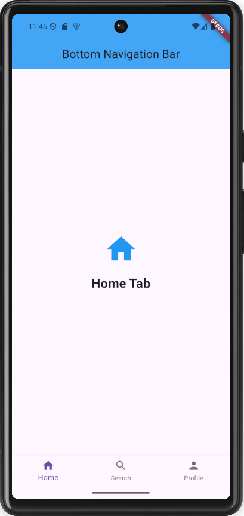

# task_10

# Bottom Navigation Bar App

A Flutter app demonstrating the use of a bottom navigation bar with three tabs (`Home`, `Search`, `Profile`). Each tab displays different content, and the transition between tabs is smooth.

## Features

- **Bottom Navigation Bar**: Three tabs for easy navigation.
- **Smooth Transitions**: Seamless switching between tabs.
- **Unique Content**: Each tab displays different content (icons and text).

