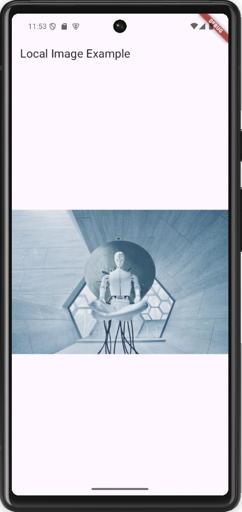

# task_11

# Local Image App

A Flutter app that displays an image from local assets.

## Features

- Displays an image stored in the local `assets` folder.
- Properly configured `pubspec.yaml` for asset management.

