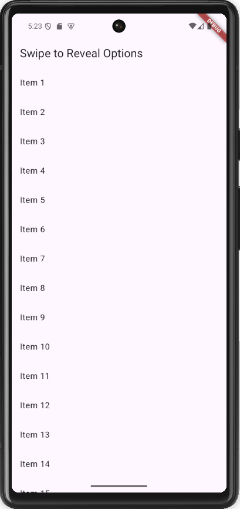
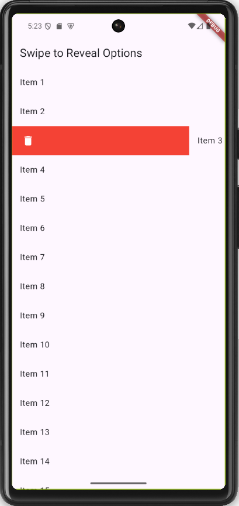
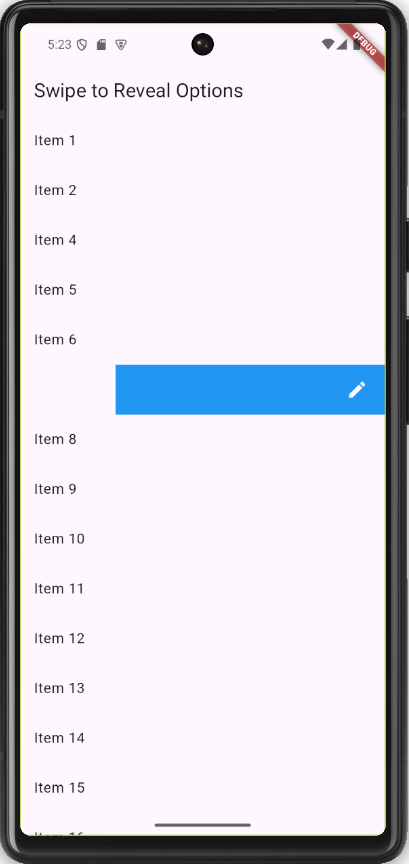

# task_14

# Swipe to Reveal Options App

A Flutter app demonstrating a list where each item can be swiped to reveal additional options like "Delete" or "Edit".

## Features

- **Swipe Actions**: Swipe left to delete, swipe right to edit.
- **Dynamic List**: Items are generated dynamically.
- **SnackBar Feedback**: Shows feedback when an item is deleted or edited.
