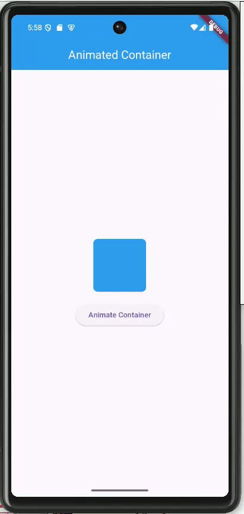

# task_16

# Animated Container App

A Flutter app demonstrating how to animate a container's size, color, and shape when a button is clicked.

## Features

- **Animated Container**: Changes size, color, and shape smoothly.
- **Button Interaction**: Clicking the button triggers the animation.
- **Customizable Animation**: Adjustable duration and curve.

