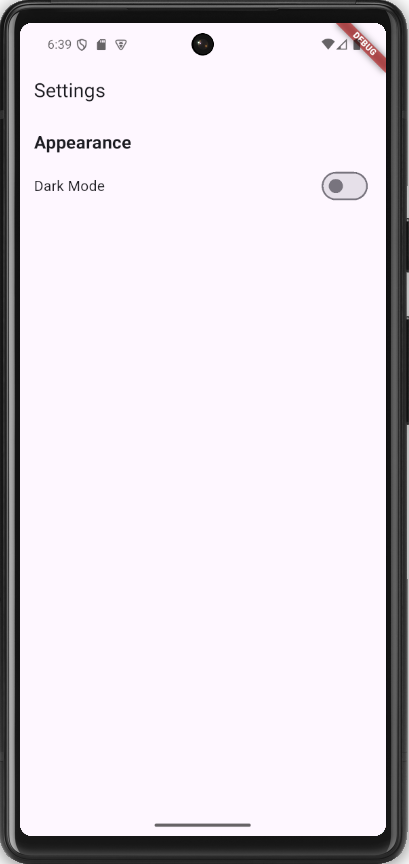

# task_17

# Settings Screen App

A Flutter app demonstrating a simple settings screen with a toggle switch to enable or disable dark mode.

## Features

- **Toggle Switch**: Enables or disables dark mode.
- **Dynamic Theme**: Changes the app's theme dynamically based on the toggle switch state.
- **Settings Screen**: Displays a clean and simple settings UI.

