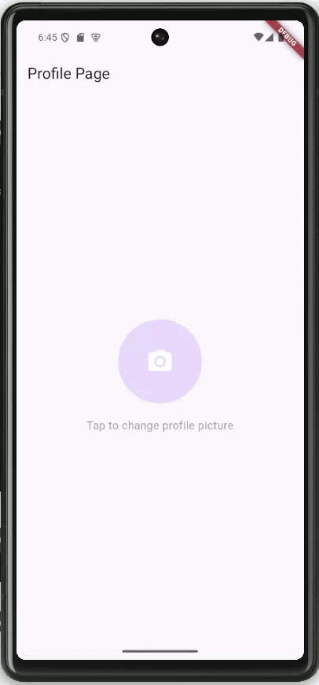

# task_18

# Profile Page App

A Flutter app demonstrating a profile page with a circular avatar. The user can choose an image from their gallery using the `image_picker` package.

## Features

- **Circular Avatar**: Displays the user's profile picture.
- **Image Picker**: Allows the user to select an image from their gallery.
- **Dynamic Update**: The avatar updates immediately after selecting a new image.
