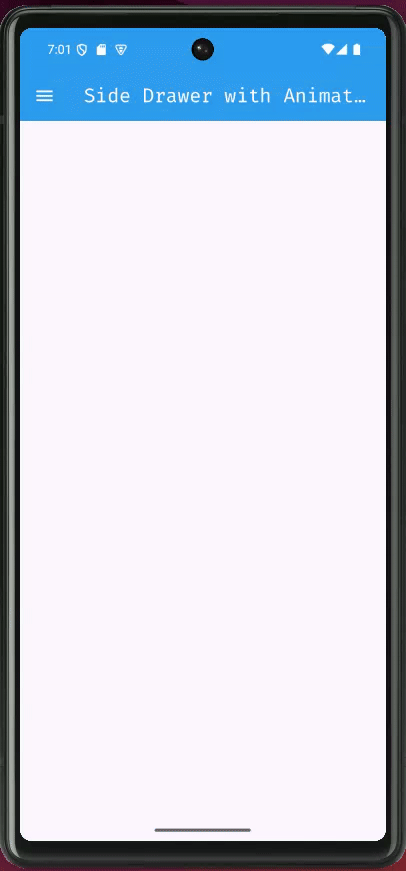

# task_19

# Custom Drawer App

A Flutter app demonstrating a custom side drawer that slides in from the left with smooth animation.

## Features

- **Custom Drawer**: Slides in from the left with a smooth animation.
- **Toggle Button**: A menu button in the app bar toggles the drawer open and closed.
- **Drawer Content**: Contains a header and a few options.

